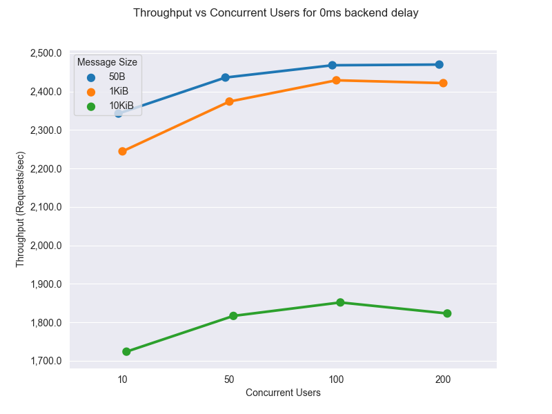
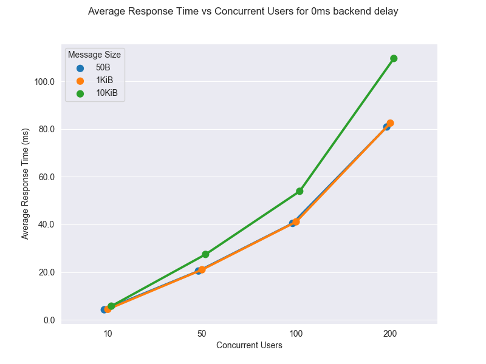
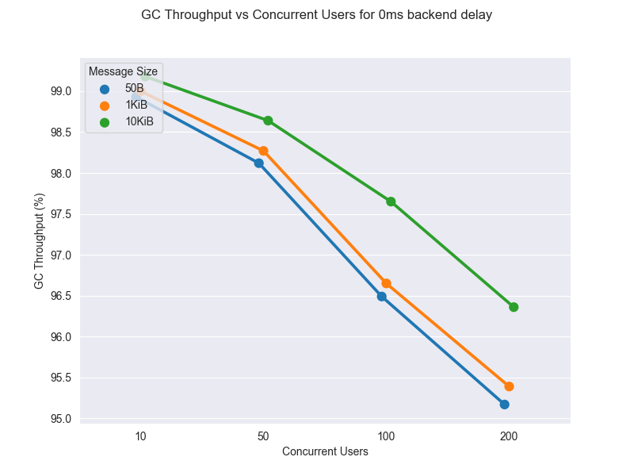

# WSO2 API Microgateway Performance Test Results

During each release, we execute various automated performance test scenarios and publish the results.

| Test Scenarios | Description |
| --- | --- |
| Microgateway-Passthrough-JWT | A secured API, which directly invokes the backend through Microgateway using JWT tokens |

Our test client is [Apache JMeter](https://jmeter.apache.org/index.html). We test each scenario for a fixed duration of
time. We split the test results into warmup and measurement parts and use the measurement part to compute the
performance metrics.

Test scenarios use a [Netty](https://netty.io/) based back-end service which echoes back any request
posted to it after a specified period of time.

We run the performance tests under different numbers of concurrent users, message sizes (payloads) and back-end service
delays.

The main performance metrics:

1. **Throughput**: The number of requests that the WSO2 API Microgateway processes during a specific time interval (e.g. per second).
2. **Response Time**: The end-to-end latency for an operation of invoking an API. The complete distribution of response times was recorded.

In addition to the above metrics, we measure the load average and several memory-related metrics.

The following are the test parameters.

| Test Parameter | Description | Values |
| --- | --- | --- |
| Scenario Name | The name of the test scenario. | Refer to the above table. |
| Heap Size | The amount of memory allocated to the application | 512M |
| Concurrent Users | The number of users accessing the application at the same time. | 10, 50, 100, 200 |
| Message Size (Bytes) | The request payload size in Bytes. | 50, 1024, 10240 |
| Back-end Delay (ms) | The delay added by the back-end service. | 0 |

The duration of each test is **900 seconds**. The warm-up period is **300 seconds**.
The measurement results are collected after the warm-up period.

A [**c5.xlarge** Amazon EC2 instance](https://aws.amazon.com/ec2/instance-types/) was used to install WSO2 API Microgateway.
To limit the cpu utilization, docker `--cpus` option is provided as 2.

The jmeter is configured such that the maximum waiting time for receiving a response to be 20 seconds.

The following are the measurements collected from each performance test conducted for a given combination of
test parameters.

| Measurement | Description |
| --- | --- |
| Error % | Percentage of requests with errors |
| Average Response Time (ms) | The average response time of a set of results |
| Standard Deviation of Response Time (ms) | The “Standard Deviation” of the response time. |
| 99th Percentile of Response Time (ms) | 99% of the requests took no more than this time. The remaining samples took at least as long as this |
| Throughput (Requests/sec) | The throughput measured in requests per second. |
| Average Memory Footprint After Full GC (M) | The average memory consumed by the application after a full garbage collection event. |

The following figures shows how the Throughput changes for different number of concurrent users with different backend delays

The following figures shows how the Average Response Time changes for different number of concurrent users with different backend delays.

Let’s look at the 90th, 95th, and 99th Response Time percentiles. 
This is useful to measure the percentage of requests that exceeded the response time value for a given percentile. 
A percentile can also tell the percentage of requests completed below the particular response time value.

The GC Throughput was calculated for each test to check whether GC operations are not impacting the performance of the server. 
The GC Throughput is the time percentage of the application, which was not busy with GC operations.

The following is the summary of performance test results collected for the measurement period.

|  Scenario Name | Heap Size | Concurrent Users | Message Size (Bytes) | Back-end Service Delay (ms) | Error % | Throughput (Requests/sec) | Average Response Time (ms) | Standard Deviation of Response Time (ms) | 99th Percentile of Response Time (ms) | WSO2 API Microgateway GC Throughput (%) | Average WSO2 API Microgateway Memory Footprint After Full GC (M) |
|---|---:|---:|---:|---:|---:|---:|---:|---:|---:|---:|---:|
|  Microgateway-Passthrough-JWT | 512M | 10 | 50 | 0 | 0 | 2342.5 | 4.23 | 5.83 | 33 | 98.93 | 19.96 |
|  Microgateway-Passthrough-JWT | 512M | 10 | 1024 | 0 | 0 | 2244.26 | 4.42 | 6.03 | 34 | 99 | 19.939 |
|  Microgateway-Passthrough-JWT | 512M | 10 | 10240 | 0 | 0 | 1723.56 | 5.75 | 21.39 | 44 | 99.18 | 19.967 |
|  Microgateway-Passthrough-JWT | 512M | 50 | 50 | 0 | 0 | 2436.14 | 20.47 | 23.68 | 92 | 98.12 | 19.987 |
|  Microgateway-Passthrough-JWT | 512M | 50 | 1024 | 0 | 0 | 2373.74 | 21.01 | 28.96 | 91 | 98.27 | 19.939 |
|  Microgateway-Passthrough-JWT | 512M | 50 | 10240 | 0 | 0 | 1816.52 | 27.44 | 24.45 | 88 | 98.64 | 19.96 |
|  Microgateway-Passthrough-JWT | 512M | 100 | 50 | 0 | 0 | 2468.06 | 40.45 | 38.58 | 158 | 96.49 | 39.799 |
|  Microgateway-Passthrough-JWT | 512M | 100 | 1024 | 0 | 0 | 2428.95 | 41.1 | 44.86 | 156 | 96.65 | 36.048 |
|  Microgateway-Passthrough-JWT | 512M | 100 | 10240 | 0 | 0 | 1851.49 | 53.91 | 34.86 | 163 | 97.65 | 46.188 |
|  Microgateway-Passthrough-JWT | 512M | 200 | 50 | 0 | 0 | 2469.85 | 80.87 | 57.82 | 267 | 95.17 | 32.126 |
|  Microgateway-Passthrough-JWT | 512M | 200 | 1024 | 0 | 0 | 2421.66 | 82.49 | 57.31 | 267 | 95.39 | 53.027 |
|  Microgateway-Passthrough-JWT | 512M | 200 | 10240 | 0 | 0 | 1822.86 | 109.59 | 59.84 | 297 | 96.36 | 51.336 |
