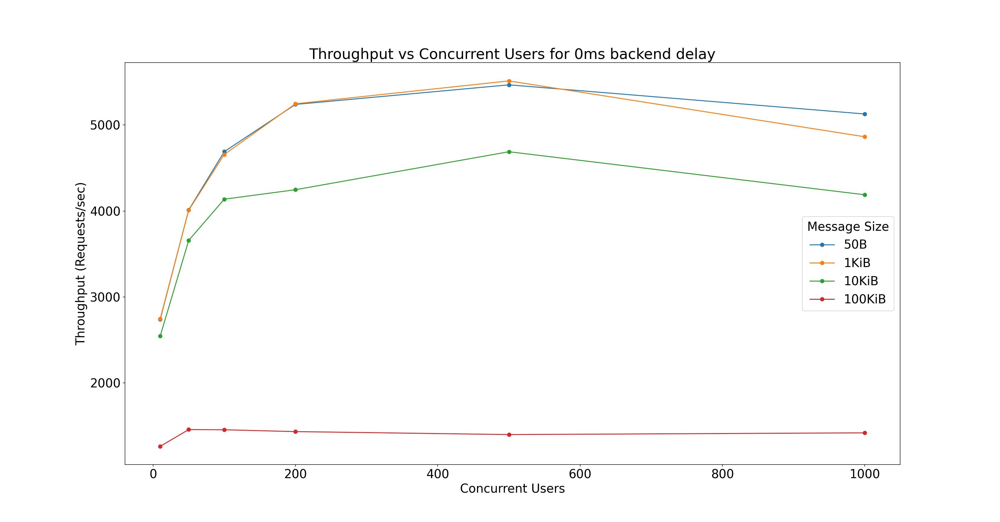
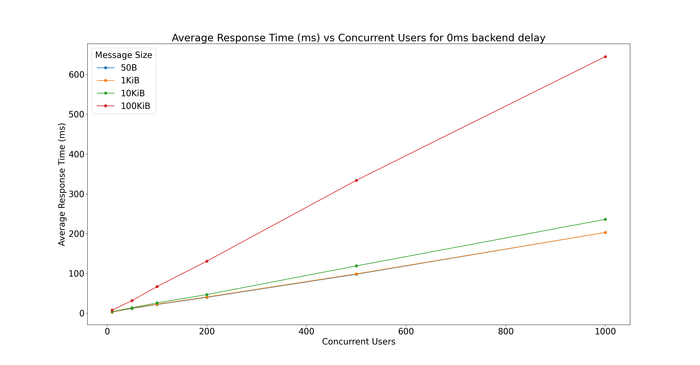
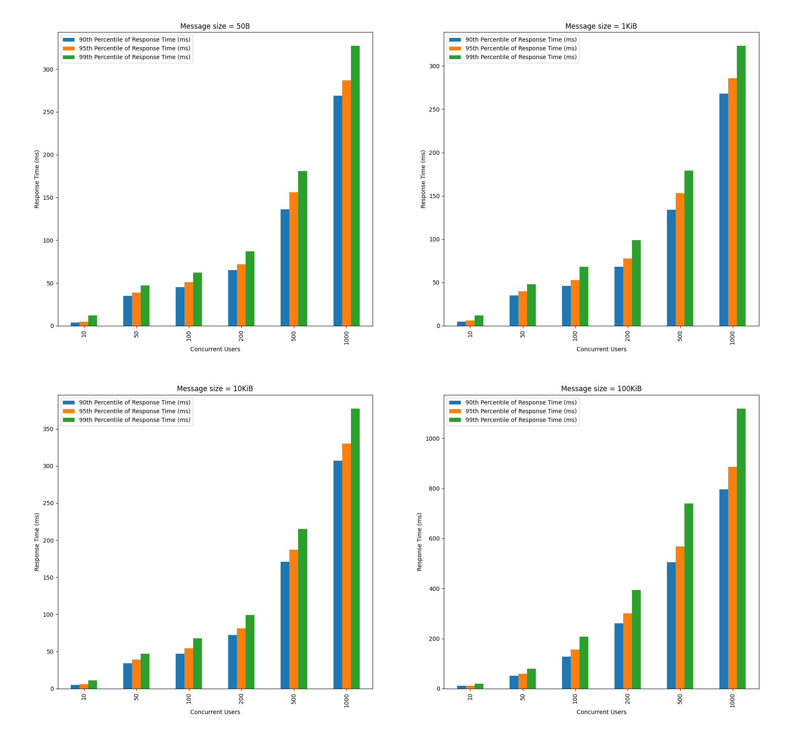

# WSO2 Choreo Connect Performance Test Results (Router CPUs = 2 , Router concurrency level = 4)

During each release, we execute various automated performance test scenarios and publish the results.

| Test Scenarios | Description |
| --- | --- |
| Invoke an API deployed in the API Manager via Choreo Connect. | A secured API, which directly invokes the backend through Choreo Connect using JWT tokens considering different user counts and message payload sizes. |

Our test client is [Apache JMeter](https://jmeter.apache.org/index.html). We test each scenario for a fixed duration of
time (15 minutes). We split the test results into warmup (5 minutes) and measurement parts and use the measurement part (test results after 5 minutes) to compute the
performance metrics.

Test scenarios use a [Netty](https://netty.io/) based back-end service which echoes back any request
posted to it.

Below diagram shows the test setup.


| Name                          | EC2 Instance Type | vCPU | Mem(GiB) |
| ----------------------------- |-------------------| ---- | -------- |
| Apache JMeter Client          | c5.large          | 2    | 4        |
| Apache JMeter Server 01       | c5.xlarge         | 4    | 8        |
| Apache JMeter Server 02       | c5.xlarge         | 4    | 8        |
| AWS EKS cluster (three nodes) | c6i.xlarge        | 4    | 8        |

> For better throughput and performance, it is able to use computer optimized nodes for the cluster. For this test we have used c6i.xlarge EC2 instances.

We executed tests for different numbers of concurrent users and message sizes (payloads).

The main performance metrics:

1. **Throughput**: The number of requests that the WSO2 Choreo Connect processes during a specific time interval (e.g. per second).
2. **Response Time**: The end-to-end latency for an operation of invoking an API. The complete distribution of response times was recorded.

In addition to the above metrics, we measure the load average and several other API request related metrics.

The following are the test parameters.

| Test Parameter       | Description                                                     | Values                      |
| -------------------- | --------------------------------------------------------------- | --------------------------- |
| Scenario Name        | The name of the test scenario.                                  | Refer to the above table.   |
| Heap Size            | The amount of memory allocated to the application               | 1024M                       |
| Concurrent Users     | The number of users accessing the application at the same time. | 10, 50, 100, 200, 500, 1000 |
| Message Size (Bytes) | The request payload size in Bytes.                              | 50, 1024, 10240, 102400     |
| Back-end Delay (ms)  | The delay added by the back-end service.                        | 0                           |

The duration of each test is **900 seconds**. The warm-up period is **300 seconds**.
The measurement results are collected after the warm-up period.

[AWS EKS cluster with **c6i.xlarge** Amazon EC2 instances](https://aws.amazon.com/eks/?nc2=type_a) were used to deploy WSO2 Choreo Connect.
When doing below test scenarios, `--cpus` option is provided as 2 and concurrency level for the router provided as 4. Replica count for the
Choreo Connect deployment was one. Below table includes configuration details relevant to the Choreo Connect deployment.

|Container Name|Requesting Memory Amount (Mi)|Requesting CPU Amount (m)|Limiting Memory Amount (Mi)|Limiting CPU Amount (m)|
|--------------|-----------------------------|-------------------------|---------------------------|-----------------------|
|Adapter       |500                          |500                      |500                        |500                    |
|Enforcer      |2000                         |1000                     |2000                       |1000                   |
|Router        |500                          |2000                     |500                        |2000                   |
|Netty backend |4096                         |2000                     |6114                       |2000                   |

For this four concurrency setup, enforcer's Java Virtual Machine's (JVM) memory allocation changed as below.
* `Xmx1500m (Maximum memory allocation for JVM)`
* `Xms1500m (Satrting memory allocation for JVM)`

Also, for the `enforcer.authService` below configurations were used.
```yaml
    [enforcer.authService]
      # Port of the Enforcer auth service
      port = 8081
      # Maximum message size in bytes
      maxMessageSize = 1000000000
      # Maximum header size in bytes
      maxHeaderLimit = 8192
      # Keep alive time in seconds for connection with the router via external authz service
      keepAliveTime = 600
      # Thread pool configurations of gRPC netty based server in Enforcer that handles the incoming requests in the Choreo Connect
      [enforcer.authService.threadPool]
        # Minimum number of workers to keep alive
        coreSize = 400
        # Maximum pool size
        maxSize = 1000
        # Timeout in seconds for idle threads waiting for work
        keepAliveTime = 600
        # Queue size of the worker threads
        queueSize = 2000
```

The jmeter is configured such that the maximum waiting time for receiving a response to be 20 seconds.

The following figures shows how the Throughput changes for different number of concurrent users with different payload sizes.


The following figures shows how the Average Response Time changes for different number of concurrent users with different payload sizes.


Let’s look at the 90th, 95th, and 99th Response Time percentiles for 0ms backend delay.
This is useful to measure the percentage of requests that exceeded the response time value for a given percentile.
A percentile can also tell the percentage of requests completed below the particular response time value.


The following are the measurements collected from each performance test conducted for a given combination of
test parameters.

| Measurement | Description |
| ----------- | ----------- |
| Error % | Percentage of requests with errors |
| Total requests | Number of requests happened during the testing period |
| Average Response Time (ms) | The average response time of a set of results |
| 90th Percentile of Response Time (ms) | 90% of the requests took no more than this time. The remaining samples took at least as long as this |
| 95th Percentile of Response Time (ms) | 95% of the requests took no more than this time. The remaining samples took at least as long as this |
| 99th Percentile of Response Time (ms) | 99% of the requests took no more than this time. The remaining samples took at least as long as this |
| Throughput (Requests/sec) | The throughput measured in requests per second. |
| Little's Law Verification |  (Throughput) x (Average Response Time) / 1000|

The following is the summary of performance test results collected for the measurement period.

|Concurrent Users|Message Size (Bytes)|Total requests|Average Response Time (ms)|Throughput (Requests/sec)|Error %|Error Count|Little's law verification|90th Percentile of Response Time (ms)|95th Percentile of Response Time (ms)|99th Percentile of Response Time (ms)|
|----------------|--------------------|--------------|--------------------------|-------------------------|-------|-----------|-------------------------|-------------------------------------|-------------------------------------|-------------------------------------|
|10              |50B                 |3057387       |2.86                      |3393.33                  |0      |0          |9.70                     |3                                    |4                                    |18                                   |
|50              |50B                 |4683200       |9.53                      |5193.08                  |0      |0          |49.49                    |22                                   |32                                   |38                                   |
|100             |50B                 |5083655       |17.62                     |5641.29                  |0      |0          |99.40                    |38                                   |43                                   |54                                   |
|200             |50B                 |5402601       |33.24                     |5995.48                  |0      |0          |199.29                   |57                                   |64                                   |80                                   |
|500             |50B                 |5289304       |85.03                     |5865.37                  |0      |0          |498.73                   |115                                  |129                                  |164                                  |
|1000            |50B                 |4967924       |181.26                    |5482.02                  |0      |0          |993.67                   |228                                  |251                                  |277                                  |
|10              |1KiB                |3052933       |2.87                      |3385.21                  |0      |0          |9.72                     |3                                    |4                                    |17                                   |
|50              |1KiB                |4479198       |9.96                      |4971.6                   |0      |0          |49.52                    |26                                   |34                                   |40                                   |
|100             |1KiB                |5049299       |17.75                     |5597.31                  |0      |0          |99.35                    |38                                   |43                                   |54                                   |
|200             |1KiB                |5527835       |32.49                     |6129.22                  |0      |0          |199.14                   |56                                   |65                                   |85                                   |
|500             |1KiB                |5332405       |84.32                     |5911.65                  |0      |0          |498.47                   |110                                  |120                                  |152                                  |
|1000            |1KiB                |4966629       |181.23                    |5502.79                  |0      |0          |997.27                   |235                                  |255                                  |283                                  |
|10              |10KiB               |2902065       |3.01                      |3220.43                  |0      |0          |9.69                     |4                                    |4                                    |10                                   |
|50              |10KiB               |4176029       |10.68                     |4630.91                  |0      |0          |49.46                    |23                                   |29                                   |36                                   |
|100             |10KiB               |4601055       |19.45                     |5106.83                  |0      |0          |99.33                    |37                                   |42                                   |54                                   |
|200             |10KiB               |4668818       |38.45                     |5179.92                  |0      |0          |199.17                   |62                                   |68                                   |80                                   |
|500             |10KiB               |4369813       |102.92                    |4847.29                  |0      |0          |498.88                   |151                                  |166                                  |187                                  |
|1000            |10KiB               |4282270       |210.37                    |4733.29                  |0      |0          |995.74                   |267                                  |281                                  |309                                  |
|10              |100KiB              |1474497       |5.92                      |1636.62                  |0      |0          |9.69                     |8                                    |9                                    |13                                   |
|50              |100KiB              |1952292       |22.82                     |2166.6                   |0      |0          |49.44                    |37                                   |43                                   |56                                   |
|100             |100KiB              |1894368       |47.28                     |2102.73                  |0      |0          |99.42                    |83                                   |96                                   |125                                  |
|200             |100KiB              |1877891       |95.64                     |2083.4                   |0      |0          |199.26                   |187                                  |226                                  |291                                  |
|500             |100KiB              |1796616       |250.55                    |1991.32                  |0      |0          |498.93                   |397                                  |439                                  |535                                  |
|1000            |100KiB              |1788542       |503.43                    |1969.33                  |0      |0          |991.42                   |655                                  |715                                  |855                                  |
