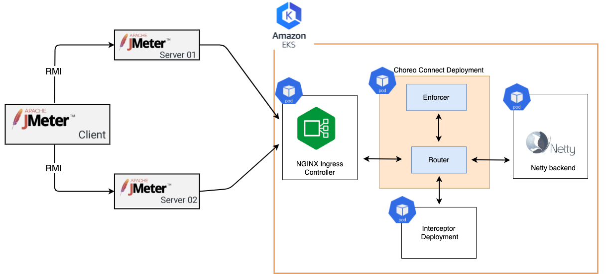

# WSO2 Choreo Connect With Interceptor Performance Test Results (Router CPU = 1 , Router concurrency level = 2)

During each release, we execute various automated performance test scenarios and publish the results.

| Test Scenarios | Description |
| --- | --- |
| Invoke an API deployed in the API Manager via Choreo Connect (with an interceptor). | A secured API, which directly invokes the backend through Choreo Connect using JWT tokens considering different user counts and message payload sizes. |

Our test client is [Apache JMeter](https://jmeter.apache.org/index.html). We test each scenario for a fixed duration of
time (15 minutes). We split the test results into warmup (5 minutes) and measurement parts and use the measurement part (test results after 5 minutes) to compute the
performance metrics.

Test scenarios use a [Netty](https://netty.io/) based back-end service which echoes back any request
posted to it.

Below diagram shows the test setup.

| Name                          | EC2 Instance Type | vCPU | Mem(GiB) |
| ----------------------------- | ----------------- | ---- | -------- |
| Apache JMeter Client          | c5.large          | 2    | 4        |
| Apache JMeter Server 01       | c5.xlarge         | 4    | 8        |
| Apache JMeter Server 02       | c5.xlarge         | 4    | 8        |
| AWS EKS cluster (three nodes) | c5.xlarge         | 4    | 8        |

For the scenarios explained here, we limited total number of concurrent user amount to 100 (for comparison purposes).

The main performance metrics:

1. **Throughput**: The number of requests that the WSO2 API Choreo Connect processes during a specific time interval (e.g. per second).
2. **Response Time**: The end-to-end latency for an operation of invoking an API. The complete distribution of response times was recorded.

In addition to the above metrics, we measure the load average and several other API request related metrics.

The following are the test parameters.

| Test Parameter       | Description                                                     | Values                      |
| -------------------- | --------------------------------------------------------------- | --------------------------- |
| Scenario Name        | The name of the test scenario.                                  | Refer to the above table.   |
| Heap Size            | The amount of memory allocated to the application               | 1024M                       |
| Concurrent Users     | The number of users accessing the application at the same time. | 10, 50, 100, 200, 500, 1000 |
| Message Size (Bytes) | The request payload size in Bytes.                              | 50, 1024, 10240, 102400     |
| Back-end Delay (ms)  | The delay added by the back-end service.                        | 0                           |

The duration of each test is **900 seconds**. The warm-up period is **300 seconds**.
The measurement results are collected after the warm-up period.

[AWS EKS cluster with **c5.xlarge** Amazon EC2 instances](https://aws.amazon.com/eks/?nc2=type_a) were used to deploy WSO2 Choreo Connect.
When doing below test scenarios, `--cpus` option is provided as 1 and concurrency level for the router provided as 2. Below table includes
configuration details relevant to the Choreo Connect deployment.

|Container Name|Requesting Memory Amount (Mi)|Requesting CPU Amount (m)|Limiting Memory Amount (Mi)|Limiting CPU Amount (m)|
|--------------|-----------------------------|-------------------------|---------------------------|-----------------------|
|Adapter       |500                          |500                      |500                        |500                    |
|Enforcer      |1000                         |1000                     |1000                       |1000                   |
|Router        |500                          |1000                     |500                        |1000                   |

The jmeter is configured such that the maximum waiting time for receiving a response to be 20 seconds.

The following table shows how the Throughput varied with interceptor addition.

|               Test Scenario name        | Users | Payload Size | Total requests | Average Response Time (ms) | Throughput (Requests/sec) | Error % | Error Count | Little's law verification | 90th Percentile of Response Time (ms) | 95th Percentile of Response Time (ms) | 99th Percentile of Response Time (ms) |
| --------------------------------------- | ----- | ------------ | -------------- | -------------------------- | ------------------------- | ------- | ----------- | ------------------------- | ------------------------------------- | ------------------------------------- | ------------------------------------- |
| Choreo Connect without interceptors     | 100   | 1KiB         | 1661783        | 35                         | 2768.5                    | 0       | 0           | 96.8975                   | 72                                    | 75                                    | 80                                    |
| Choreo Connect with request interceptor | 100   | 1KiB         | 1150405        | 68                         | 1457.4                    | 0       | 0           | 99.1032                   | 102                                   | 106                                   | 152                                   |

Also, we evaluated a single performance test combining API invocation with an interceptor (for 50 concurrent users) and normal API invocation (for 50 concurrent users) considering a single Choreo Connect deployment. Below table shows test results relevant to that scenario.

|Test Scenario name                       | Users | Payload Size | Total requests | Average Response Time (ms) | Throughput (Requests/sec) | Error % | Error Count | Little's law verification | 90th Percentile of Response Time (ms) | 95th Percentile of Response Time (ms) | 99th Percentile of Response Time (ms) |
| --------------------------------------- | ----- | ------------ | -------------- | -------------------------- | ------------------------- | ------- | ----------- | ------------------------- | ------------------------------------- | ------------------------------------- | ------------------------------------- |
| Choreo Connect without interceptors     | 50    | 1KiB         | 677123         | 43                         | 1128.7                    | 0       |             | 48.5341                   | 75                                    | 78                                    | 82                                    |
| Choreo Connect with request interceptor | 50    | 1KiB         | 478943         | 62                         | 798.4                     | 0       |             | 49.5008                   | 87                                    | 89                                    | 95                                    |
